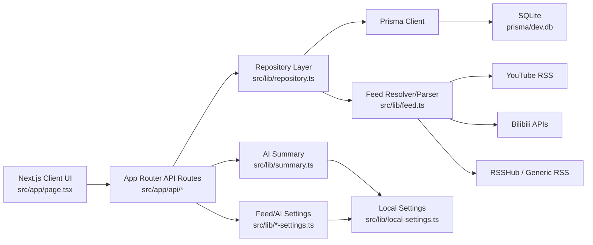

# LXY Reader Project Context

## Current Snapshot

- Primary workspace: `/Users/luqiming/Downloads/work/codex/LXYAPP/lxy-reader`.
- Runtime URL: `http://localhost:3001/`.
- Framework: Next.js 16 App Router, React 19, Tailwind CSS 4, Prisma 6, SQLite.
- Current branch state when this file was created: local `main` is ahead of `origin/main` by 4 commits.
- Important merge note: earlier UI work was first merged in `/Users/luqiming/.codex/worktrees/a8b3/LXYAPP/lxy-reader`, then brought into this primary workspace via local fetch/merge.
- Current local merge head: `f332d01 Merge remote-tracking branch 'codex-worktree/main' into codex-downloads-pre-ui-sync`.
- Dev server has been restarted from this primary workspace after regenerating Prisma Client.

## Key Decisions

- Use `/Users/luqiming/Downloads/work/codex/LXYAPP/lxy-reader` as the main workspace going forward.
- Keep data local with SQLite at `prisma/dev.db`; environment uses `DATABASE_URL="file:./dev.db"`.
- Store app-local secrets and runtime settings in local settings files via `src/lib/local-settings.ts`, not in browser-visible state.
- Keep feed ingestion server-side:
  - YouTube uses direct YouTube RSS where possible.
  - Bilibili has direct API fallback logic and optional Cookie support.
  - RSSHub routes remain supported through normal URL and `rsshub://` inputs.
- UI direction:
  - Sidebar uses compact icon navigation with hover labels.
  - Detail actions use icon-only buttons with hover labels.
  - Settings uses large vertical cards inspired by the supplied reference image.
- Theme preference is browser-local:
  - `Light`, `Dark`, and `Follow the system`.
  - Preference is stored in `localStorage` using `lxy-theme-preference`.
  - Effective theme is applied through `document.documentElement.dataset.theme`.
- Do not remove current `/Downloads/...` work:
  - It contains read-later, AI settings, local settings, OPML tests, dark theme tests, and related changes that were preserved before merging previous UI work.

## Completed Work

### Feed And Subscription Core

- Subscription CRUD via `/api/subscriptions`.
- Subscription preview and creation flow.
- Refresh/fetch per subscription, selected source, selected folder, or all feeds.
- Content items sorted by publish time and creation time.
- Friendly error messages for common RSS/RSSHub/network/Bilibili failure modes.
- OPML import/export support.

### Platforms And Parsing

- YouTube feed resolution from `rsshub://youtube/user/...` handles channel lookup and direct YouTube RSS.
- Bilibili direct archive API support exists, including risk-control detection.
- RSSHub base URL and access-code support are configurable through Settings.
- Normalized item model includes title, author, URL, publish time, summary, content HTML, thumbnail, media type, platform, embed URL, and raw payload.

### Data Model

- `Subscription`
  - Stores feed/source metadata, status, last fetch/error, optional folder.
- `SourceFolder`
  - Groups subscriptions; deleting a folder moves subscriptions back to uncategorized.
- `ContentItem`
  - Stores normalized feed items and media metadata.
- `UserItemState`
  - Tracks read/unread, favorite, and read-later state.
- `AiSummary`
  - Stores AI generated summary per item.

### UI

- Sidebar:
  - Header keeps LXY logo/name and top-right `+` add button.
  - Horizontal icon toolbar includes All Feeds, Videos, Articles, Favorites, Read Later.
  - All Feeds/Videos/Articles/Favorites show compact unread counts.
  - Settings icon sits next to Refresh in the sidebar footer.
  - Hover labels are used for icon-only navigation.
- Timeline:
  - Supports All Feeds, Videos, Articles, Favorites, Read Later.
  - Supports source and folder filtering.
- Detail panel:
  - Top actions are icon-only: Open Original, Copy Link, Favorite, Read Later, Mark Read/Unread.
  - Video actions are icon-only: Play Embedded/Open Video Page.
  - AI Summary generate/regenerate uses icon button.
  - Show Cover uses icon button.
- Settings:
  - General, AI Configuration, Network, OPML, Sources are card-style sections.
  - Theme Preference buttons are functional.
  - Network preserves RSSHub Base URL, access-code status, Bilibili Cookie, refresh interval display, save/clear controls.
  - Sources uses left source list + right detail panel with Rename, Enable/Disable, Delete.

### Local Settings

- `src/lib/local-settings.ts` centralizes local settings persistence.
- `src/lib/feed-settings.ts` manages RSSHub/Bilibili settings.
- `src/lib/ai-settings.ts` manages OpenAI API key/model.
- Public API responses never return plaintext secret values.

### Tests And Verification

- `npm run lint` passes after the merge.
- Prisma Client had to be regenerated with `npm run db:generate` after merging `SourceFolder` model.
- Browser verified after merge:
  - current `/Downloads/...` app loads at `localhost:3001`.
  - compact sidebar UI appears.
  - detail action buttons are iconified.
  - SourceFolder APIs load after Prisma Client regeneration.

## Important Files

### App Shell And UI

- `src/app/page.tsx`
  - Main client UI and most page/component state.
  - Contains Home, Sidebar, Timeline, DetailPanel, SettingsView, SourceFolderModal, AddSubscriptionModal, etc.
  - Owns client-side view selection, selected item/source/folder, optimistic item state, modals, theme preference wiring.

- `src/app/globals.css`
  - Tailwind import and global base styles.
  - Contains dark theme overrides keyed by `html[data-theme="dark"]`.

- `src/app/layout.tsx`
  - Root layout and metadata.

### API Routes

- `src/app/api/items/route.ts`
  - Lists items, optionally filtered by folder.

- `src/app/api/items/[id]/read/route.ts`
- `src/app/api/items/[id]/unread/route.ts`
- `src/app/api/items/[id]/favorite/route.ts`
- `src/app/api/items/[id]/unfavorite/route.ts`
- `src/app/api/items/[id]/read-later/route.ts`
- `src/app/api/items/[id]/unread-later/route.ts`
  - Mutate per-item user state.

- `src/app/api/items/[id]/summary/route.ts`
  - Generates AI summary for an item.

- `src/app/api/subscriptions/route.ts`
- `src/app/api/subscriptions/[id]/route.ts`
- `src/app/api/subscriptions/[id]/fetch/route.ts`
- `src/app/api/subscriptions/preview/route.ts`
- `src/app/api/subscriptions/opml/route.ts`
  - Subscription CRUD, fetch, preview, and OPML.

- `src/app/api/source-folders/route.ts`
- `src/app/api/source-folders/[id]/route.ts`
  - Source folder CRUD.

- `src/app/api/settings/feed/route.ts`
  - Public feed settings read/update.

- `src/app/api/ai/config/route.ts`
  - Public AI config read/update.

### Server Libraries

- `src/lib/repository.ts`
  - Main database access layer.
  - Subscription/item/folder/state/fetch/import operations.

- `src/lib/feed.ts`
  - Feed input resolution, RSSHub URL building, YouTube/Bilibili/RSS parsing, normalization.

- `src/lib/summary.ts`
  - AI summary generation.

- `src/lib/opml.ts`
  - OPML build/parse.

- `src/lib/opml-import-message.ts`
  - OPML import result messaging.

- `src/lib/preview-display.ts`
  - Preview empty/warning message helper.

- `src/lib/theme-preference.ts`
  - Theme preference normalization and effective-theme calculation.

- `src/lib/prisma.ts`
  - Prisma singleton.

### Data And Config

- `prisma/schema.prisma`
  - Source of truth for data model.

- `prisma/init.sql`
  - SQLite initialization schema.

- `prisma/dev.db`
  - Local SQLite DB. It changes during runtime and after schema updates.

- `.env`
  - Contains `DATABASE_URL` and default `RSSHUB_BASE_URL`.

## Recent Merge History

- `e482684`: V4 baseline from `origin/main`.
- `bbc4d9e`: Preserved current `/Downloads/...` workspace changes before UI sync.
- `06d76c0`: Prior UI merge from `.codex/worktrees/...`.
- `f332d01`: Merged prior UI work into `/Downloads/...` main.

Notes:

- `prisma/dev.db` had a merge conflict because `/Downloads/...` had read-later columns while `.codex/worktrees/...` had SourceFolder schema.
- Resolution preserved `/Downloads/...` DB as base and added SourceFolder table plus `Subscription.folderId`.
- `prisma/schema.prisma` and `prisma/init.sql` now include both SourceFolder and read-later fields.
- After merging schema changes, `npm run db:generate` was required so runtime Prisma Client knew about `sourceFolder` and `Subscription.folder`.

## Architecture Overview

## Key Runtime Flows

### Add Subscription

1. User opens Add Subscription modal from sidebar `+`.
2. Preview route resolves input and previews feed.
3. Confirm creates or updates `Subscription`.
4. Initial fetch writes `ContentItem` records.
5. UI reloads subscriptions/items/folders/config.

### Refresh Feeds

1. Refresh action chooses selected source, selected folder, or all sources.
2. Inactive subscriptions are skipped.
3. Each selected subscription calls `/api/subscriptions/[id]/fetch`.
4. Repository fetches normalized items and upserts new content.
5. UI shows refresh report.

### Item State

1. UI optimistically updates read/favorite/read-later.
2. API route writes `UserItemState`.
3. Confirmed response reconciles UI state.
4. If current view is Favorites or Read Later and the item is removed, selection moves to next visible item.

### Theme Preference

1. SettingsView receives `themePreference` and `onThemePreferenceChange`.
2. User selects Light/Dark/Follow the system.
3. Preference is saved in `localStorage`.
4. `html[data-theme]` updates to effective theme.
5. `globals.css` applies dark overrides.

## Known Caveats

- Current `main` is ahead of `origin/main`; changes are local until pushed.
- `prisma/dev.db` is tracked and changes with local runtime/schema state. Be careful when committing/pushing DB changes.
- Dev server may need restart after Prisma schema/client changes.
- If `localhost:3001` says port is in use but browser cannot load, check stale Node processes with:
  - `lsof -nP -iTCP:3001 -sTCP:LISTEN`
  - stop stale process before restarting.
- There are two historically relevant workspaces:
  - Primary now: `/Users/luqiming/Downloads/work/codex/LXYAPP/lxy-reader`
  - Old sync source: `/Users/luqiming/.codex/worktrees/a8b3/LXYAPP/lxy-reader`

## Recommended Next Steps

- Decide whether to push local `main` ahead commits to remote.
- Consider whether `prisma/dev.db` should remain tracked or be treated as local development state.
- Add focused tests for:
  - SourceFolder CRUD and folder-filtered item list.
  - Read Later state transitions and Read Later view removal behavior.
  - Theme preference persistence and system mode.
  - OPML import edge cases.
- Consider extracting large UI sections from `src/app/page.tsx` into smaller components once behavior stabilizes.
- Review dark-mode CSS coverage across all panels and modals after more UI changes.
