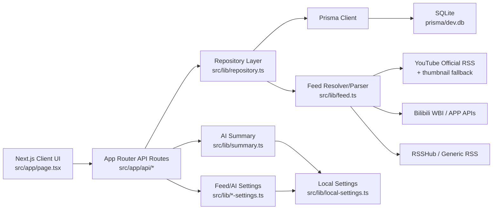

# LXY Reader Project Context

更新日期: 2026-06-04  
版本标记: V5.3 待提交/推送  
主工作区: `/Users/luqiming/Downloads/work/codex/LXYAPP/lxy-reader`  
外层项目目录: `/Users/luqiming/Downloads/work/codex/LXYAPP`  
本地预览: `http://localhost:3000/`  
应用仓库: `https://github.com/luqiming19820311/LXYAPP-lxy-reader`  
外层仓库: `https://github.com/luqiming19820311/LXYAPP`

## 快速恢复

```bash
cd /Users/luqiming/Downloads/work/codex/LXYAPP/lxy-reader
git status --short --branch
npm run dev -- --port 3000
```

如果新增 API route、Prisma schema、Tailwind/global CSS 或前端交互没有生效，优先重启 dev server。V5.3 验证时使用 `http://localhost:3000/`；历史文档曾使用 `3001`，如端口冲突可改用 `3001`。

## 关键决策

1. LXY 是本地优先的电脑端 AI RSS 信息聚合阅读器，v0.1 先以浏览器 Web 应用跑通个人使用闭环。
2. 当前核心闭环是: 添加订阅源 -> 抓取内容 -> 标准化入库 -> 时间线展示 -> 详情阅读/播放 -> 已读/收藏/稍后读 -> 手动 AI 摘要。
3. 技术栈固定为 Next.js 16 App Router、React 19、Tailwind CSS 4、TypeScript、Prisma 6、SQLite、`rss-parser`、`lucide-react`。
4. 数据本地化保存在 SQLite `prisma/dev.db`；该文件目前被 Git 跟踪，会随运行、刷新、导入、阅读状态变化而改变，提交前要确认是否纳入版本。V5.3 不主动提交 `prisma/dev.db`。
5. Prisma 继续固定在 6.x。当前环境中 `prisma db push` / `prisma migrate dev` 可能出现空的 schema engine 错误，因此 `prisma/init.sql` 是初始化 schema 的重要备份。
6. YouTube 优先走官方 RSS，可从频道 URL / handle 解析 channel ID；播放使用 YouTube iframe，不再跨平台 fallback 到 Bilibili。
7. Bilibili 优先使用本地 adapter，不依赖公共 RSSHub；遇到 Web WBI 风控时 fallback 到 APP archive 接口。
8. RSSHub 仍支持普通 HTTP URL 和 `rsshub://` 输入，Base URL、access code、Bilibili Cookie 可在 Settings 中配置。
9. 本机敏感配置统一通过 `src/lib/local-settings.ts` 写入 `.lxy-settings.json`；API 只返回 configured/missing，不返回 Key、Cookie、access code 明文。
10. AI 摘要为手动触发，不做自动批量摘要；默认模型为 `gpt-5`，调用 OpenAI Responses API。
11. UI 保持阅读器工具形态: 左侧紧凑图标导航，中间时间线，右侧详情/播放/摘要，Settings 为垂直卡片布局。
12. 主题偏好为浏览器本地设置，支持 Light、Dark、Follow the system，存储 key 为 `lxy-theme-preference`。
13. 左侧 Sidebar 宽度可拖拽，默认 `260px`，范围 `212px-360px`，存储 key 为 `lxy-sidebar-width`。
14. 从 Settings 点击左侧 Sources 文件夹或博主，会自动回到 All Feeds 并应用对应筛选，避免停留在 Settings 无法跳转。
15. Dark 模式采用全局 utility override 修正浅色设计系统残留；V5.3 进一步让侧栏选中行使用自包含高对比样式，避免混用 `bg-white` 导致深色模式选中态发白、文字发淡。
16. 视频封面统一用真实 `` 渲染并设置 `referrerPolicy="no-referrer"`；Bilibili 使用抓取到的封面，YouTube 缺失封面时从 videoId fallback 到 `https://i.ytimg.com/vi/<id>/hqdefault.jpg`。

## 已完成部分

### Feed 与订阅核心

1. 订阅源 CRUD: `/api/subscriptions`、`/api/subscriptions/[id]`。
2. 订阅预览与确认添加: `/api/subscriptions/preview`。
3. 单来源、文件夹、全部来源刷新: `/api/subscriptions/[id]/fetch`。
4. 内容标准化入库，并按发布时间、创建时间排序。
5. 友好错误提示覆盖 RSS/RSSHub/网络/Bilibili/Prisma 常见失败。
6. OPML 导入导出: `/api/subscriptions/opml`。
7. SourceFolder 分组模型与 API 已实现，删除文件夹会把订阅移回未分类。

### 平台与解析

1. 普通 RSS/Atom、RSSHub HTTP、`rsshub://` 均可预览和抓取。
2. YouTube:
   - 支持频道页、handle、RSSHub YouTube 路由转官方 RSS。
   - 支持 Shorts/embed/live/watch URL 的 videoId 解析。
   - 支持 `yt:video:<id>` feed id 解析。
   - iframe 参数包含 autoplay、playsinline、rel、enablejsapi、origin、widget_referrer。
   - 监听 postMessage 播放状态，区分 loading/playing/blocked。
   - V5.3 新增缩略图 fallback，feed 缺少 media thumbnail 时从 videoId 生成 `i.ytimg.com` 封面。
3. Bilibili:
   - 支持 `rsshub://bilibili/user/video/:mid` 转本地 `bilibili://user/video/:mid`。
   - 优先 Web WBI archive API。
   - 风控错误 `-352`、`-412`、`request was banned` 时 fallback 到 APP archive。
   - 标准化 bvid、aid、标题、描述、封面、发布时间、作者、embedUrl。
   - V5.3 封面显示改为 ``，解决 CSS background-image 场景下 Bilibili 封面可能不显示的问题。

### 数据模型与状态

1. `Subscription`: 订阅源元数据、状态、抓取错误、可选 `folderId`。
2. `SourceFolder`: 来源分组，保存分组名称与订阅关系。
3. `ContentItem`: 标准化内容、媒体元数据、平台、embedUrl、raw payload。
4. `UserItemState`: 已读、收藏、稍后读及对应时间。
5. `AiSummary`: 每条内容的 AI 摘要、模型、promptVersion。
6. 前端使用乐观更新和 `stateOverridesRef`，避免已读/收藏/稍后读状态短暂回弹。

### UI 与交互

1. 三栏主界面: 左侧导航与来源、中间时间线、右侧详情。
2. 左侧导航:
   - All Feeds、Videos、Articles、Favorites、Read Later。
   - 图标导航带 hover label。
   - Settings 和 Refresh 在底部。
   - Sources 区域独立滚动。
   - Sidebar 可拖拽宽度，刷新后保留。
   - Dark 模式下文件夹箭头、文件夹图标、文件夹名称、Add/Manage 按钮可读性已提亮。
   - V5.3 选中文件夹/来源行使用 `lxy-sidebar-selected-row` 自包含样式，Dark 下深底、亮边框、亮文字、亮徽标。
3. 来源筛选:
   - 可按单来源筛选。
   - 可按 SourceFolder 筛选。
   - Settings 中点击来源或文件夹会跳回内容列表。
4. 时间线:
   - 支持搜索标题、摘要、来源、类型。
   - 支持 All/Videos/Articles/Favorites/Read Later 过滤。
   - 无结果和加载错误有独立状态。
   - 视频条目左侧缩略图显示真实封面，图片加载失败时回退到平台占位。
5. 详情页:
   - Open Original、Copy Link、Favorite、Read Later、Mark Read/Unread 图标按钮。
   - Dark 模式下详情操作按钮使用深色底、亮边框和亮图标，避免低对比度。
   - YouTube/Bilibili iframe 播放。
   - 详情视频大封面显示真实缩略图，点击播放后切换 iframe，Show Cover 后回到封面。
   - 缺失封面或封面加载失败时显示平台化占位。
   - Content Context 展示正文上下文。
   - AI Summary 手动生成/重新生成。
6. Settings:
   - General、AI Configuration、Network、OPML、Sources 卡片。
   - 主题偏好可切换并持久化。
   - AI Key/模型可保存和清除。
   - RSSHub Base URL、access code、Bilibili Cookie 可配置。
   - 订阅源可重命名、启用/停用、删除。

### 验证结果

1. V5.3 最近执行通过:
   - `npm run lint`
   - `npm run test -- src/lib/feed.test.mts`
   - `npm run test -- src/lib/dark-theme-css.test.mts`
2. V5.3 浏览器验证:
   - Bilibili 列表小缩略图和详情大封面均真实加载。
   - YouTube 旧数据即使 `thumbnailUrl` 为空，也能从 videoId fallback 加载缩略图。
   - 点击播放后 iframe 正常出现，Show Cover 后恢复封面。
   - Dark 模式下选中 `科学上网` 文件夹和 `一只游民` 来源，背景为深色 `rgb(17, 24, 39)`，文字/图标为 `rgb(248, 250, 252)`，数字徽标为深底亮字。
   - `SourceStatusDot` 在线绿色点保持原有逻辑，未在 V5.3 中修改。
3. 之前已验证:
   - Sidebar 默认宽度 `260px`。
   - 拖拽宽度可达 `212px-360px`，刷新后保留。
   - Settings 点击“小Lin说”跳到对应来源列表。
   - Settings 点击“科学上网”跳到对应文件夹列表。
   - YouTube 小Lin说多条视频可嵌入播放。
   - Bilibili 风控 fallback 到 APP archive 可返回视频列表。
   - Read Later API 可置入和移出真实内容。
   - AI 设置保存/清除假 Key 不泄露明文。

## 待办事项

### 高优先级

1. 推送 V5.3 后确认 GitHub:
   - 应用仓库 `main` 有 V5.3 提交。
   - 外层仓库如使用 submodule，需要同步指针。
   - `project-context.md` 已更新到 V5.3。
2. 测试真实 OpenAI 摘要调用:
   - 保存真实 OpenAI API Key。
   - 对真实内容生成摘要。
   - 刷新后确认 `AiSummary` 保留。
   - 确认错误提示足够友好。
3. 决定 `prisma/dev.db` 长期策略:
   - 继续纳入 Git，保留真实样本和本地状态。
   - 或改为只提交 schema/seed，减少运行状态噪音。

### 中优先级

1. SourceFolder 相关自动化测试:
   - 文件夹 CRUD。
   - 文件夹筛选 item list。
   - 删除文件夹后订阅回到未分类。
2. Theme 测试:
   - localStorage 偏好保存。
   - system 模式跟随系统。
   - dark mode 覆盖所有卡片、弹窗、时间线、按钮。
3. OPML 导入增强:
   - 导入后可选择是否自动刷新。
   - 更完整处理重复、缺失 xmlUrl、异常 outline。
4. Settings 抓取配置增强:
   - RSSHub access code 独立清除按钮。
   - Bilibili Cookie 使用说明和状态反馈。
5. 全文搜索:
   - 当前为前端过滤。
   - 后续可考虑 SQLite FTS。

### 后续版本

1. Electron/Tauri 桌面包装。
2. Profile 页面真实实现。
3. 多端同步。
4. 自动摘要和批量摘要。
5. 视频播放源发现和缓存。
6. 订阅源 favicon 抓取。
7. 更细的失败重试与后台刷新策略。

## 重要文件修改记录

### 文档

`project-context.md`

- 本文件，作为新会话恢复上下文的主要入口。
- V5.3 更新:
  - 记录视频缩略图修复。
  - 记录 Dark 模式选中来源/文件夹高对比修复。
  - 记录当前验证结果和待办状态。
- V5.2 更新:
  - 记录 Dark 模式未读标记和若干图标对比度修复。
  - 记录当前验证结果和待办状态。

### 前端主界面

`src/app/page.tsx`

- 主 UI 和交互文件，包含 Home、Sidebar、Timeline、DetailPanel、SettingsView、SourceFolderModal、AddSubscriptionModal 等。
- V5.3 重点:
  - 新增 `getVideoCoverUrl`，YouTube 缺少缩略图时从 videoId fallback 到 `i.ytimg.com`。
  - 新增 `VideoCoverImage`，列表和详情封面改为 ``，设置 `referrerPolicy="no-referrer"`、`loading="lazy"`、`decoding="async"`，加载失败回退平台占位。
  - Sidebar 选中来源/文件夹改为 `lxy-sidebar-selected-row` 自包含样式入口，不再混用 `bg-white shadow-sm`。
- V5/V5.1/V5.2 重点:
  - 图标化 Sidebar 与详情页操作按钮。
  - SourceFolder 筛选与管理。
  - Read Later 真实视图和详情按钮。
  - Settings 卡片化布局。
  - 主题偏好 wiring。
  - Sidebar 可拖拽宽度，localStorage 持久化。
  - Settings 中点击来源/文件夹自动跳回内容列表。
  - 时间线未读圆点从深蓝灰改为在线状态同款绿色 `#17bf7d`。

`src/app/globals.css`

- Tailwind 引入和全局样式。
- 包含 `:root[data-theme="dark"]` 的深色主题覆盖。
- 保留系统字体，避免 Google Fonts 网络依赖。
- V5.3 重点:
  - 新增 `.lxy-sidebar-selected-row` light/dark 自包含样式。
  - Dark 下选中来源/文件夹使用深底 `#111827`、亮边框 `#aeb8c7`、亮文字 `#f8fafc`、亮徽标。
- V5.2 重点:
  - 补齐 Dark 模式下 `text-[#34495f]`、`text-[#46566b]`、`text-[#4b5b70]`、`text-[#3f4650]` 等颜色 override。
  - 提亮 `border-[#d3d7de]`、`border-[#c9ced6]`。
  - 将 `bg-[#f6f4f5]` 在 Dark 模式映射为深色按钮底，修复详情页 ghost 图标按钮低对比度。

`src/app/layout.tsx`

- Root layout 和页面 metadata。

### 核心库与测试

`src/lib/feed.ts`

- Feed 输入解析、RSSHub URL 构造、YouTube/Bilibili/RSS 抓取与标准化。
- V5.3 新增 `buildFallbackThumbnailUrl`，YouTube feed item 缺少 media thumbnail 时从 `contentUrl` 的 videoId 生成缩略图。
- `getYouTubeVideoId` 支持 `yt:video:<id>`。

`src/lib/feed.test.mts`

- V5.3 新增测试: RSSHub JSON/YouTube feed 缺少 media thumbnail 时，应生成 `https://i.ytimg.com/vi/<id>/hqdefault.jpg`。

`src/lib/dark-theme-css.test.mts`

- V5.3 新增测试: Dark 主题下 selected sidebar row 需要保留 `lxy-sidebar-*` 样式钩子，并避免重新混入 `bg-white shadow-sm`。

`src/lib/repository.ts`

- 数据访问层，负责订阅、内容、文件夹、用户状态、抓取入库、OPML 导入。

`src/lib/local-settings.ts`

- 本机设置文件读写，避免不同设置模块互相覆盖。

`src/lib/feed-settings.ts`

- RSSHub Base URL、access code、Bilibili Cookie 的读取与保存。

`src/lib/ai-settings.ts`

- OpenAI API Key 和默认摘要模型的读取与保存。

`src/lib/summary.ts`

- 调用 OpenAI Responses API 并 upsert `AiSummary`。

`src/lib/opml.ts`

- OPML 构建和解析。

`src/lib/theme-preference.ts`

- 主题偏好标准化和 effective theme 计算。

### API Routes

```text
src/app/api/items/route.ts
src/app/api/items/[id]/read/route.ts
src/app/api/items/[id]/unread/route.ts
src/app/api/items/[id]/favorite/route.ts
src/app/api/items/[id]/unfavorite/route.ts
src/app/api/items/[id]/read-later/route.ts
src/app/api/items/[id]/unread-later/route.ts
src/app/api/items/[id]/summary/route.ts
src/app/api/subscriptions/route.ts
src/app/api/subscriptions/[id]/route.ts
src/app/api/subscriptions/[id]/fetch/route.ts
src/app/api/subscriptions/preview/route.ts
src/app/api/subscriptions/opml/route.ts
src/app/api/source-folders/route.ts
src/app/api/source-folders/[id]/route.ts
src/app/api/settings/feed/route.ts
src/app/api/ai/config/route.ts
```

- Next 16 动态 route handler 使用 `{ params: Promise<{ id: string }> }` 或 `RouteContext<"...">`，读取时需要 `await context.params`。

### 数据与配置

`prisma/schema.prisma`

- Prisma 数据模型来源。
- 当前包含 `Subscription`、`SourceFolder`、`ContentItem`、`UserItemState`、`AiSummary`。

`prisma/init.sql`

- SQLite 初始化 schema。
- 用来绕过当前环境里 Prisma schema engine 迁移不稳定的问题。

`prisma/dev.db`

- 本地 SQLite 数据库。
- 当前被 Git 跟踪，可能包含真实抓取内容和用户状态。
- V5.3 提交默认不包含该运行状态变化，除非用户明确要求。

`.env`

```env
DATABASE_URL="file:./dev.db"
RSSHUB_BASE_URL="https://rsshub.app"
```

`.lxy-settings.json`

- 本机运行时设置文件。
- 保存 RSSHub/Bilibili/OpenAI 相关设置。
- 不应在 API 中返回明文敏感字段。

## 整体架构思路



### 运行流

1. Add Subscription:
   - 用户输入 URL。
   - preview route 解析输入并预览。
   - confirm 创建或更新订阅。
   - 初次抓取写入 `ContentItem`。
   - 前端刷新订阅、内容、文件夹和配置。
2. Refresh:
   - 根据当前选择刷新单来源、文件夹或全部来源。
   - inactive 来源跳过。
   - repository 抓取并 upsert 内容。
   - UI 显示 refresh report。
3. Item State:
   - 前端乐观更新 read/favorite/readLater。
   - API 写入 `UserItemState`。
   - 成功后用服务端响应校准。
   - Favorites/Read Later 移除当前条目时自动选择下一条。
4. Theme:
   - Settings 选择 Light/Dark/System。
   - localStorage 保存 `lxy-theme-preference`。
   - `document.documentElement.dataset.theme` 驱动 CSS 覆盖。
   - V5.3 中侧栏选中态使用组件 class + global CSS 的组合，降低 Tailwind arbitrary utility 在 Dark 模式下互相覆盖的风险。
5. Video Cover:
   - API 返回 `thumbnailUrl` 时前端优先使用。
   - YouTube 旧数据或 feed 缺失缩略图时，从 `contentUrl`/`embedUrl` videoId fallback 到 `i.ytimg.com`。
   - Bilibili 使用抓取封面，前端 `` 降低防盗链影响。
   - 图片失败时回退到 `PlatformPlaceholder`。
6. AI Summary:
   - Settings 保存 Key 和模型。
   - 详情页手动触发摘要。
   - Route Handler 调用 `summary.ts`。
   - 结果写入 `AiSummary` 并回显。

## 下次会话建议

1. 优先读取本文件。
2. 检查应用仓库状态:

```bash
cd /Users/luqiming/Downloads/work/codex/LXYAPP/lxy-reader
git status --short --branch
```

3. 如需同步外层仓库 submodule 指针:

```bash
cd /Users/luqiming/Downloads/work/codex/LXYAPP
git status --short --branch
```

4. 如需继续开发，先确认 `prisma/dev.db` 是否应该随功能提交。
5. 如需验证 UI，打开 `http://localhost:3000/`，重点看:
   - Sidebar 拖拽。
   - Settings 来源/文件夹跳转。
   - Dark 模式选中文件夹/来源对比度。
   - YouTube/Bilibili 列表缩略图与详情大封面。
   - YouTube/Bilibili 播放与 Show Cover。
