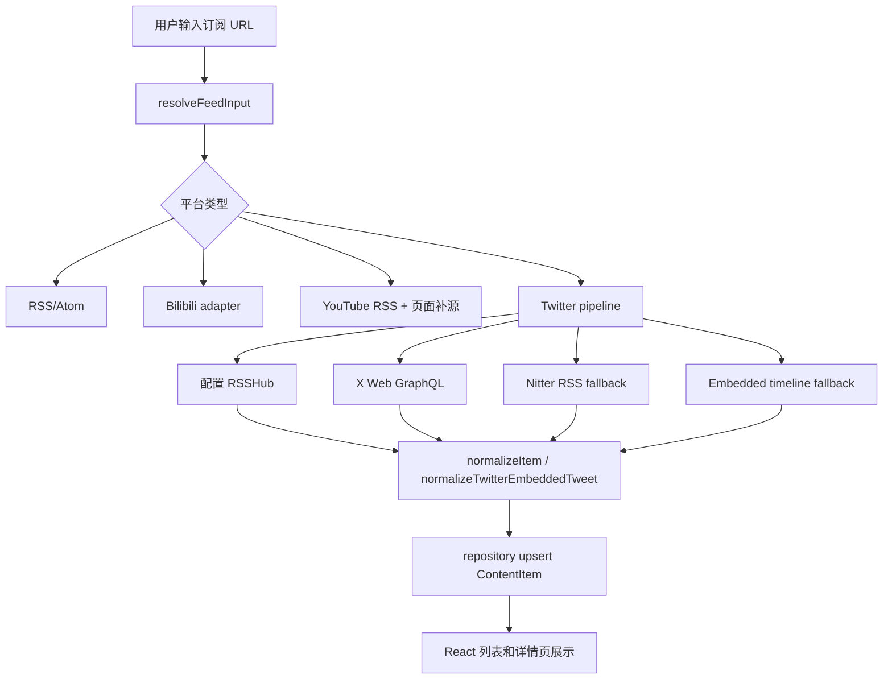

# LXY Reader Project Context

版本: V7.0
更新日期: 2026-06-17
主工作区: `/Users/luqiming/Downloads/work/codex/LXYAPP/lxy-reader`
远程仓库: `https://github.com/luqiming19820311/LXYAPP-lxy-reader.git`
当前分支: `main`
本地开发服务: 默认 `http://localhost:3000/`，如 3000 被占用可用 `npm run dev -- --port 3001`

## V7.0 摘要

V7.0 主要目标是修复阅读器的基础 bug，并完成 Twitter 获取能力。当前版本已经能通过 `rsshub://twitter/user/<username>` 添加 Twitter 订阅，在默认 RSSHub 或 X 匿名接口只能返回旧 highlights/pinned 内容时，继续 fallback 到可用 RSS 源获取最新 posts，解决了 `Twitter @宝玉` 只能显示 195d/197d ago、不能读取 1 天内最新内容的问题。

本版已完成的核心能力:

1. 新增 Twitter 获取链路。
2. 修复 Twitter 无法读取最新信息的问题，尤其是默认 `rsshub.app` 返回旧内容或 X `UserTweets` 只暴露 highlights 的场景。

已验证结果:

- `Twitter @宝玉` 最新条目可显示为小时级时间，例如 `7h ago`。
- 实网拉取 `rsshub://twitter/user/dotey` 第一条为 `baoyu-design skill 可以在本地生成动画视频...`。
- 对应发布时间为 `2026-06-17T00:21:40.000Z`。

## 快速恢复

```bash
cd /Users/luqiming/Downloads/work/codex/LXYAPP/lxy-reader
git status --short --branch
npm install
npm run dev -- --port 3000
```

如果 3000 被其它应用占用:

```bash
npm run dev -- --port 3001
```

常用验证命令:

```bash
npm run test -- src/lib/feed.test.mts src/lib/repository.test.mts
npm run lint
```

## 当前项目定位

LXY Reader 是一个本地优先的 AI RSS Reader，用来订阅、阅读和管理多平台内容源。项目目前以三栏阅读器为主界面:

- 左侧: folders、sources、设置入口。
- 中间: 当前筛选下的内容列表。
- 右侧: 内容详情、收藏、稍后读、打开原文等操作。

支持的主要内容源:

- 普通 RSS/Atom。
- RSSHub URL。
- `rsshub://` shorthand。
- Bilibili 用户视频。
- YouTube channel/user。
- Weibo。
- Twitter/X 用户时间线。

## 整体架构思路

### 前端

- 框架: Next.js App Router + React。
- 主页面集中在 `src/app/page.tsx`。
- UI 采用本地状态驱动，围绕订阅列表、内容列表、详情面板和设置面板组织。
- Twitter 内容使用专属渲染块，避免影响其它平台的文章/视频详情展示。

### 后端与数据层

- API routes 位于 `src/app/api/**`。
- 业务读写集中在 `src/lib/repository.ts`。
- 抓取、解析、标准化集中在 `src/lib/feed.ts`。
- 数据库使用 Prisma + SQLite。
- Prisma schema 位于 `prisma/schema.prisma`。
- 本地数据库文件为 `prisma/dev.db`。

### 内容抓取层

所有平台最终都会被标准化为 `ContentItem`:

- `title`
- `author`
- `contentUrl`
- `publishedAt`
- `summary`
- `contentHtml`
- `thumbnailUrl`
- `mediaType`
- `platform`
- `embedUrl`
- `rawPayload`

Twitter 仍复用现有 `status` 模型:

- `platform: "twitter"`
- `mediaType: "status"`
- `embedUrl: null`

不新增数据库 schema，Twitter 的媒体和作者元信息通过 `contentHtml` 中的 hidden payload 与 `rawPayload` 保存。

## 关键决策

1. Twitter 输入方式固定为 `rsshub://twitter/user/<username>`，用户不需要输入 GraphQL URL、Nitter URL 或 X API URL。
2. `Subscription.inputUrl` 保留用户原始输入，`Subscription.feedUrl` 保存构造后的 RSSHub URL，方便将来切换到稳定 RSSHub。
3. 如果用户配置了自定义 RSSHub Base URL 或 access code，优先相信配置后的 RSSHub。
4. 默认 `rsshub.app` 对 Twitter 不稳定，不能作为 Twitter 最新内容的唯一来源。
5. Twitter fallback 只在 Twitter 分支内部启用，不影响 YouTube、Bilibili、Weibo 和普通 RSS。
6. X Web GraphQL `UserTweets` 如果只返回 `pinned_tweets`、`profile_best_highlights` 或 `highlights`，不能当作真正最新时间线。
7. 当 X 匿名时间线只暴露 highlights 时，fallback 到 Nitter RSS 搜索源，使用 `from:<username> -filter:replies -filter:retweets` 获取最新 posts。
8. Nitter RSS 只是 fallback，不改变用户订阅地址和数据库中的 `feedUrl`。
9. Twitter 详情页不使用官方 embed/widget，不引入登录态，不接入付费 API。
10. AI 摘要继续手动触发，不因 Twitter 抓取逻辑自动生成摘要。
11. `prisma/dev.db` 是本地运行态文件，刷新订阅和页面验证会修改它。
12. 本版优先修 bug 和数据获取，不做无关 UI 重构。

## 已完成部分

### Twitter 获取

- 支持解析 `rsshub://twitter/user/<username>`。
- 支持 Twitter RSSHub 成功路径。
- 支持默认 RSSHub 失败或返回旧数据后的 fallback。
- 支持 X Web GraphQL:
  - 动态解析 query id。
  - 激活 guest token。
  - 调用 `UserByScreenName`。
  - 调用 `UserTweets`。
  - 在必要时调用 `UserHighlightsTweets` 作为最后兜底。
- 支持 embedded timeline 兜底。
- embedded timeline 遇到 Node fetch 429/503 时，支持 Twitter-only `curl` fallback。
- 加入 Twitter 获取缓存和 singleflight，减少 Preview 与 Confirm 连续请求造成的限流。
- 加入 Nitter RSS fallback，解决 `@dotey` 等账号匿名 X 只返回旧 highlights 的问题。

### Twitter 最新内容修复

- 修复 `Twitter @宝玉` 只能显示 195d/197d/198d ago 的问题。
- 对 `UserTweets` 只返回 pinned/highlights 的场景，不再误判为成功。
- 使用 Nitter RSS 搜索结果补充普通最新 posts。
- 将 Nitter 链接规范化为 `https://x.com/<username>/status/<tweetId>`。
- 按发布时间降序排序，避免旧内容排在顶部。

### Twitter 内容标准化

- Tweet id 兼容:
  - `id_str`
  - `conversation_id_str`
  - GraphQL `rest_id`
  - RSS `guid`
  - status URL
- 正文兼容:
  - RSS title/description
  - embedded `full_text`
  - embedded `text`
  - GraphQL `legacy.full_text`
  - GraphQL `note_tweet.note_tweet_results.result.text`
- 作者兼容:
  - RSS `dc:creator`
  - embedded `tweet.user`
  - GraphQL `core.user_results`
- 媒体兼容:
  - 图片 URL。
  - 视频封面图。
  - GraphQL 视频 mp4 variant。
  - Nitter RSS 图片代理 URL。
- 互动数兼容:
  - replies
  - reposts
  - likes
  - views

### Twitter 详情展示

- `src/app/page.tsx` 中存在 Twitter 专属详情块。
- 展示内容包括:
  - 头像。
  - display name。
  - handle。
  - 日期。
  - 完整正文。
  - 图片。
  - 视频。
  - 互动数。
  - `Open on X`。
- 非 Twitter 内容仍走原本详情渲染，不受 Twitter 逻辑影响。

### 测试与验证

已通过:

```bash
npm run test -- src/lib/feed.test.mts src/lib/repository.test.mts
npm run lint
git diff --check -- src/lib/feed.ts src/lib/feed.test.mts src/lib/repository.test.mts
```

覆盖的关键用例:

- Twitter RSSHub 成功读取。
- 默认 RSSHub 旧数据不覆盖 X/补源最新数据。
- X Web GraphQL 正常返回时优先使用 GraphQL。
- X `UserTweets` 只返回 highlights 时使用 Nitter 最新 posts。
- Nitter fallback 返回 `2026-06-17` 的最新 Twitter 内容。
- X highlights 作为最后兜底仍可工作。
- Twitter 图片、视频、meta payload 能进入标准化 item。
- repository 创建 Twitter 订阅可写入 status item。

## 待办事项

### 高优先级

1. 用户人工验证 V7.0 页面效果:
   - `Twitter @宝玉` 顶部不再是 197d ago。
   - 最新内容显示为小时级或当天内容。
   - 打开详情后正文、图片、视频显示正常。
2. 观察 Nitter fallback 稳定性。如果公共实例失效，需要新增可配置项，而不是硬编码更多实例池。
3. 明确 `prisma/dev.db` 是否长期纳入版本管理。它现在包含本地刷新后的运行态数据。

### 中优先级

1. 给 Twitter 详情块补前端组件级测试。
2. 将 `src/app/page.tsx` 拆分为更小组件，降低主页面文件复杂度。
3. Settings 中增加 Twitter/RSSHub 配置说明:
   - 默认 RSSHub 公共实例不稳定。
   - 支持自定义 Base URL。
   - 支持 access code。
4. Add Subscription preview 可考虑显示 Twitter 缩略图，但不要影响其它平台。
5. 继续保持 YouTube、Bilibili、Weibo、普通 RSS 的回归测试。

### 后续版本

1. 后台自动刷新任务。
2. 失败重试队列。
3. 多端同步。
4. AI 摘要批量处理。
5. 订阅 favicon 抓取。
6. 桌面端打包。

## 重要文件修改记录

### `src/lib/feed.ts`

职责: 输入解析、RSS/RSSHub 解析、平台抓取、fallback、内容标准化。

V7.0 重点:

- 新增 Twitter 平台识别。
- 新增 Twitter RSSHub/default RSSHub 判断。
- 新增 X Web GraphQL fallback。
- 新增 embedded timeline fallback。
- 新增 Nitter RSS fallback。
- 新增 Twitter media/meta 标准化。
- 新增 Twitter cache/singleflight。
- 修复 old highlights 被误判为最新时间线的问题。

### `src/app/page.tsx`

职责: 主界面、订阅输入、列表、详情页、设置。

V7.0 重点:

- 支持 Twitter 订阅输入识别。
- Twitter 请求 timeout 更长，避免 fallback 链路被前端提前中断。
- Twitter 详情页使用专属渲染。
- 从 `contentHtml` hidden payload 和 `rawPayload` 恢复 Twitter 媒体和元信息。

### `src/lib/feed.test.mts`

职责: feed 层单元测试。

V7.0 重点:

- 覆盖 Twitter RSSHub、GraphQL、embedded、highlights、Nitter fallback。
- 覆盖 `@dotey` 最新内容场景。
- 覆盖旧 RSSHub 内容不应覆盖最新补源内容。

### `src/lib/repository.test.mts`

职责: repository 层订阅创建和入库测试。

V7.0 重点:

- 覆盖 Twitter 订阅创建。
- 覆盖初次抓取写入 status item。
- 使用测试专用 Twitter username，避免测试误删真实本地订阅。

### `prisma/schema.prisma`

职责: Prisma 数据模型定义。

V7.0 状态:

- 没有为 Twitter 新增 schema。
- Twitter 复用 `ContentItem`。

### `prisma/dev.db`

职责: 本地 SQLite 数据库。

V7.0 状态:

- 已因真实刷新 `Twitter @宝玉` 订阅发生变化。
- 当前本地库中 `Twitter @宝玉` 已包含 2026-06-17 的最新条目。

## 数据流说明



## 当前注意事项

- `localhost:3000` 可能被 Obsidian 占用；如果页面显示 `Open Presentation Preview in Obsidian first!`，请改用 3001。
- Twitter/X 匿名接口不稳定，Nitter RSS fallback 是为了补足最新 posts，但也可能受公共实例可用性影响。
- 如果后续要长期稳定抓 Twitter，建议支持用户配置自建 RSSHub 或可配置 Nitter/RSS fallback base URL。
- 提交前建议再次运行测试与 lint。
